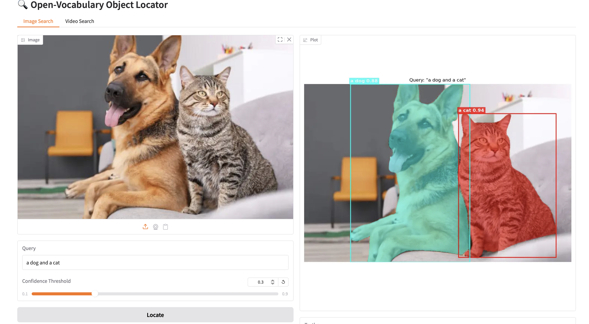
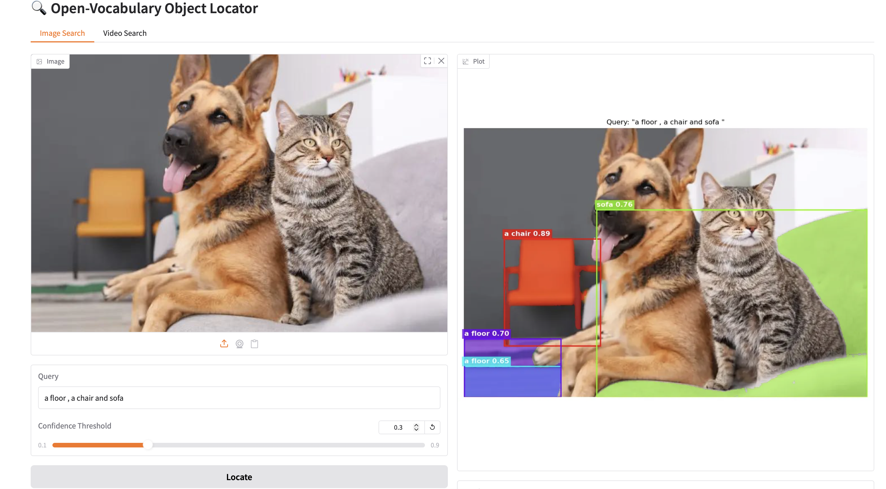

# 🔍 Open-Vocabulary Object Locator & Tracker

An advanced, open-vocabulary object detection, segmentation, and video tracking tool. This application allows you to find and track *any* object in images or videos simply by typing a text query (e.g., "a dog"). 

It leverages a powerful pipeline of state-of-the-art vision models:
1. **Grounding DINO:** Performs zero-shot object detection based on your text query to generate initial bounding boxes.
2. **OpenAI CLIP:** Validates the cropped bounding boxes against your query to filter out false positives and improve accuracy.
3. **Meta SAM 2 (Segment Anything 2):** Generates pixel-perfect segmentation masks for images and handles temporal propagation (tracking) across video frames.

## ✨ Features
* **Image Search:** Upload an image, type a query, and get a precise segmentation mask and bounding box plotted over your image.
* **Video Tracking:** Upload a video and type a query. The system will locate the object in the first frame and seamlessly track its segmentation mask throughout the rest of the video.
* **Interactive UI:** Built with Gradio for a simple, intuitive web interface.
* **Cross-Platform Acceleration:** Automatically detects and utilizes CUDA (Nvidia), MPS (Apple Silicon), or CPU.

## Screenshots

### Image Detection & Segmentation



### Multiple Object Detection




## 🎬 Demo

A complete demonstration of the project, including image localization, segmentation results, and video object tracking, can be found at the link below:

🔗 **Demo Video:** [https://drive.google.com/file/d/1-HxWd76x4vTRF-dq6ylKg8cLTv-UbE0C/view?usp=sharing]


Example queries include:

* "a dog and a cat"
* "a white puppy"
* "puppies and trees"

The video demonstrates the full pipeline from text query to detection, segmentation, and temporal tracking across video frames.


## 🛠️ Prerequisites
* Python 3.10 or higher recommended.
* Git installed on your machine.
* A machine with a GPU (CUDA) or Apple Silicon (MPS) is highly recommended for video processing speeds, though it will run (slowly) on a CPU.

## 🚀 Installation

**1. Clone the repository:**
```bash
git clone https://github.com/EsayasA/CV_project.git
cd CV_project

2. Install dependencies:
Install the required Python packages using the provided requirements.txt file.

pip install -r requirements.txt


3. Download the SAM 2 Checkpoint:
The application expects the sam2_hiera_large.pt model weights inside a checkpoints/ directory. You can download this using curl or wget:

Using curl (Recommended for macOS/Windows):

mkdir checkpoints
cd checkpoints
curl -O https://dl.fbaipublicfiles.com/segment_anything_2/072824/sam2_hiera_large.pt
cd ..


Using wget (Recommended for Linux):

mkdir checkpoints
cd checkpoints
wget https://dl.fbaipublicfiles.com/segment_anything_2/072824/sam2_hiera_large.pt
cd ..

💻 Usage
Run the Gradio application:

Bash
python app.py
Open your web browser and navigate to the local URL provided in the terminal (usually http://127.0.0.1:7860).

For Images: Go to the "Image Search" tab, upload a picture, type what you want to find, adjust the confidence threshold if needed, and click "Locate".

For Videos: Go to the "Video Search" tab, upload a short video, type the object you want to track, and click "Track". (Note: Video processing may take some time depending on your hardware).

📁 Project Structure

app.py: The main Gradio web interface layout and event binding.

main.py: The ProjectPipeline that handles the core image and video processing logic (including SAM 2 video state initialization and propagation).

sam_mask.py: The GroundedSamHandler that glues Grounding DINO, CLIP, and SAM 2 together for image-level detection and segmentation.

clip_test.py: A utility class to calculate similarity scores between image crops and text queries using CLIP.

utils.py: Helper functions for drawing bounding boxes and overlaying masks via Matplotlib/NumPy.

requirements.txt: Python package dependencies.
